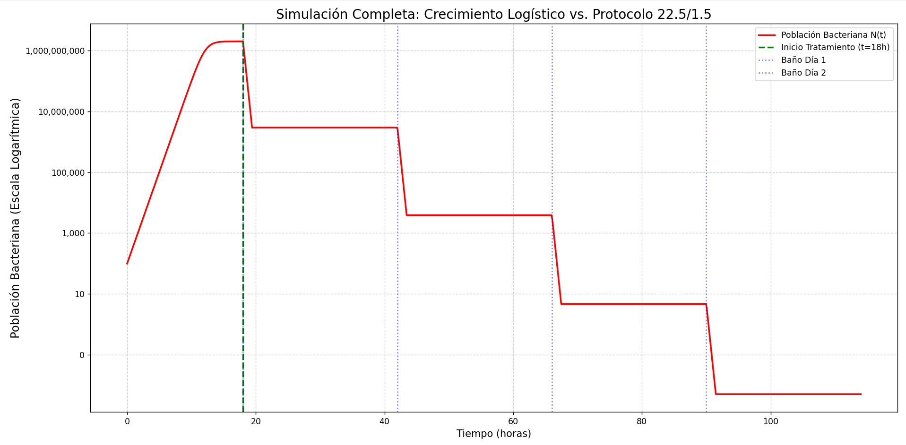

# Bacterial Logistic Growth and Decay Simulation
Probably not very accurate logistic bacterial growth simulation using matplotlib and numpy.


## Main Purpose

This project aims to **simulate and visualize the logistic growth model** ($N(t)$) for a pathogenic bacterial population, such as *Pseudomonas aeruginosa*.

The primary objective is to **understand the full life cycle kinetics** of an infection (like SCUD). This includes the rapid growth phase and the subsequent decay phase. Understanding this entire process helps **substantiate and validate an effective treatment protocol (e.g., 22.5/1.5 dry-docking) when treating an animal with limited resources.**

By modeling the speed at which an infection reaches its carrying capacity ($K$) and how it behaves afterward, an intervention can be designed to collapse the growth rate ($\mu$) and permit a successful recovery.




## The Models

### 1. The Logistic Growth Model: $N(t)$

This model describes the "S-curve" growth phase, where the population is limited by a carrying capacity.

$$N(t) = \frac{K}{1 + \left(\frac{K - N_0}{N_0}\right) e^{-\mu t}}$$

Where:
- **$N(t)$**: Population at time $t$.
- **$K$**: Carrying capacity (maximum sustainable population).
- **$N_0$**: Initial population.
- **$\mu$ (mu)**: Specific growth rate.
- **$t$**: Time.

### 2. The Decay (Death) Phase Model

This is the final phase in a closed system (batch culture). It occurs after the stationary phase, once nutrients are depleted and/or toxic waste products become lethal.

The model for this phase is typically **first-order decay kinetics**, which is the reverse of exponential growth. The rate of death is proportional to the current living population.

The differential model is:

$$\frac{dN}{dt} = -k_d \cdot N$$

Where **$k_d$** is the **specific death rate** (units of 1/time).

The solution $N(t)$ for the decay phase (starting after the stationary phase) is:

$$N(t) = K \cdot e^{-k_d (t - t_s)}$$

Where:
- **$N(t)$**: Population at time $t$ (during the death phase).
* **$K$**: Population at the start of this phase (the carrying capacity).
* **$k_d$**: The specific death rate.
* **$t_s$**: The time at which the death phase begins (end of stationary phase).
* **$(t - t_s)$**: The time elapsed since the decay phase began.

## Script Features

* **Define** the initial parameters ($N_0$, $K$, $g$).
* **Calculate** the specific growth rate $\mu$.
* **Generate** a time vector using `numpy`.
* **Compute** the population $N(t)$ for each time point during growth.
* **Use** `matplotlib` to graph the resulting S-curve.
* **Plot** reference lines for $K$ and the Inflection Point ($K/2$).

## Requirements

To run this simulation, you will need:
* Python 3.x
* Numpy
* Matplotlib

You can install the dependencies using `pip`:
```bash
pip install numpy matplotlib
```

## Usage

To run the simulation, execute the script from your terminal:

```bash
python your_script_name.py
```
---
## References

Here are some foundational sources used for the concepts in this project, covering microbiological kinetics, mathematical modeling, and their application in reptile medicine.

### 1. For General Microbiology and Bacterial Kinetics (*Pseudomonas*)

Madigan, M. T., Bender, K. S., Buckley, D. H., Sattley, W. M., & Stahl, D. A. (2021). *Brock Biology of Microorganisms* (16th ed.). Pearson.

* **Why:** This is a standard university textbook that details the principles of bacterial growth, including the phases (log, stationary, death) and the factors affecting growth rate ($\mu$).

### 2. For the Mathematical Logistic Model

Murray, J. D. (2002). *Mathematical Biology: I. An Introduction* (3rd ed.). Springer.

* **Why:** This is a classic text on mathematical biology that formally derives and explains population models, including the logistic equation $N(t)$ and the concept of carrying capacity ($K$).

### 3. For the Clinical Application (SCUD in Reptiles)

Divers, S. J., & Stahl, S. J. (Eds.). (2019). *Mader's Reptile and Amphibian Medicine and Surgery* (3rd ed.). Elsevier.

* **Why:** This is the definitive veterinary reference (the "bible") for reptile diseases. It describes the pathology of Septicemic Cutaneous Ulcerative Disease (SCUD) and identifies *Pseudomonas aeruginosa* as a primary causative agent.